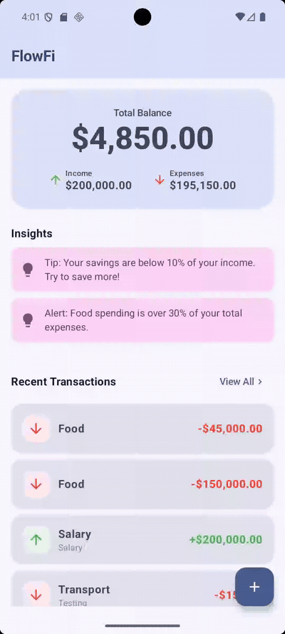
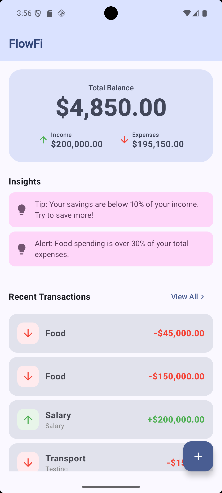
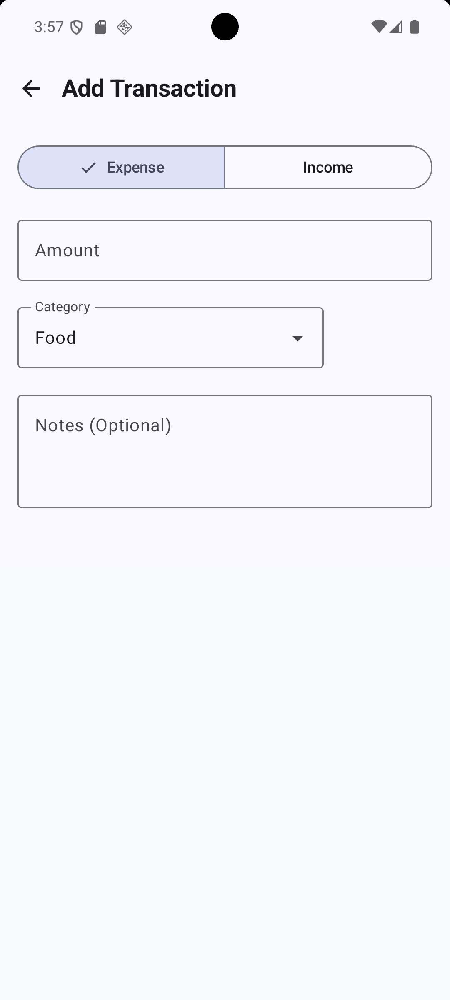
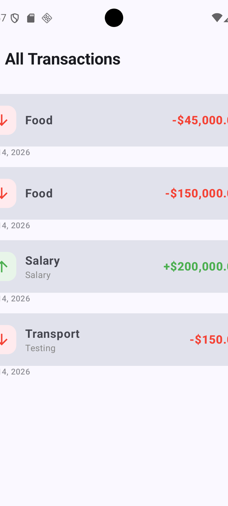

# FlowFi

[](https://github.com/saadkhalidkhan/FlowFi/actions/workflows/ci.yml)
[](https://github.com/saadkhalidkhan/FlowFi/actions/workflows/docs.yml)
[](https://opensource.org/licenses/MIT)
[](https://github.com/saadkhalidkhan/FlowFi/releases)
[](https://kotlinlang.org/)
[](app/build.gradle.kts)
[](app/build.gradle.kts)
[](https://developer.android.com/jetpack/compose)

A fast, Material 3 personal finance app that turns data into decisions — track spending, get behavioral guidance, and progress toward savings goals. Built with Kotlin, Jetpack Compose, Room, and MVVM.

## Demo

<p align="center">
  
</p>

<p align="center">
  <sub>Also available as <a href="docs/media/flowfidemo.webm">flowfidemo.webm</a> (higher quality)</sub>
</p>

## Screenshots

<p align="center">
  
  
  
</p>

<p align="center">
  <sub>Dashboard · Add / Edit · View All</sub>
</p>

## Features

### Transactions
- **Transaction tracking** — Record income and expenses with amount, category, date, and notes
- **Edit transactions** — Tap any item on the dashboard or list to update it
- **Delete with undo** — Swipe to delete on the list; tap Undo on the snackbar to restore
- **List filters** — Narrow the full history by month and category
- **Financial dashboard** — Monthly balance, income, and expense totals
- **Transaction history** — Chronological list with dates

### Insights & goals
- **Insight engine** — Behavioral guidance such as week-over-week food spending, spending vs your monthly average, and savings rate trends
- **Category analytics** — Monthly expense breakdown with percentage bars (Food, Shopping, Bills, and more)
- **Savings goals** — Create goals (Emergency fund, Travel, etc.), add funds, and track progress visually
- **Insights hub** — Open from the dashboard **Guidance** card for charts, insights, and goals in one place

### Design
- **Material 3 UI** — Dynamic color, light/dark themes, edge-to-edge layout

## In the app

1. **Dashboard** — See this month’s balance and a preview of your top insight; tap **Guidance** for the full Insights hub
2. **Add / edit** — Use **+** or tap a transaction to record or update spending
3. **View all** — Browse history, filter by month or category, swipe to delete (with Undo)
4. **Insights** — Review guidance, category charts, and savings goal progress

## Installation

**Requirements:** Android Studio Ladybug or newer, JDK 17+, Android SDK 36

```bash
git clone https://github.com/saadkhalidkhan/FlowFi.git
cd FlowFi
./gradlew :app:assembleDebug
```

Install on a device or emulator:

```bash
./gradlew :app:installDebug
adb shell am start -n com.example.flowfi/.MainActivity
```

## Usage examples

### Insert a transaction

```kotlin
import com.example.flowfi.data.database.AppDatabase
import com.example.flowfi.data.entity.TransactionEntity
import com.example.flowfi.data.entity.TransactionType
import com.example.flowfi.data.repository.TransactionRepositoryImpl

val repository = TransactionRepositoryImpl(
    AppDatabase.getDatabase(context).transactionDao()
)

repository.insertTransaction(
    TransactionEntity(
        amount = 42.50,
        category = "Food",
        date = System.currentTimeMillis(),
        type = TransactionType.EXPENSE,
        note = "Lunch"
    )
)
```

### Observe totals in a ViewModel

```kotlin
import com.example.flowfi.data.entity.TransactionType
import kotlinx.coroutines.flow.map

repository.getAllTransactions()
    .map { list ->
        val income = list.filter { it.type == TransactionType.INCOME }.sumOf { it.amount }
        val expenses = list.filter { it.type == TransactionType.EXPENSE }.sumOf { it.amount }
        income - expenses // balance
    }
```

### Create a savings goal

```kotlin
import com.example.flowfi.data.entity.SavingsGoalEntity

savingsGoalRepository.insertGoal(
    SavingsGoalEntity(
        name = "Emergency fund",
        targetAmount = 5000.0,
        currentAmount = 250.0
    )
)
```

### Generate behavioral insights

```kotlin
import com.example.flowfi.domain.InsightEngine

val insights = InsightEngine.generate(transactions)
insights.forEach { println(it.message) }
```

### Wire repositories in `Application`

```kotlin
class FlowFiApplication : Application() {
    val database by lazy { AppDatabase.getDatabase(this) }
    val repository by lazy { TransactionRepositoryImpl(database.transactionDao()) }
    val savingsGoalRepository by lazy {
        SavingsGoalRepositoryImpl(database.savingsGoalDao())
    }
}
```

## Documentation

API reference is generated with [Dokka](https://kotlinlang.org/docs/dokka-introduction.html):

```bash
./gradlew :app:dokkaGeneratePublicationHtml
```

Output: `app/build/dokka/html/`

Published docs (GitHub Pages): **https://saadkhalidkhan.github.io/FlowFi/**

> First-time setup: enable Pages under **Settings → Pages → Build and deployment → Source: GitHub Actions**, or run  
> `gh api -X POST repos/saadkhalidkhan/FlowFi/pages -f build_type=workflow`

## Project structure

```
FlowFi/
├── app/
│   └── src/main/java/com/example/flowfi/
│       ├── data/          # Room entities, DAOs, repositories
│       ├── domain/        # InsightEngine, CategoryAnalytics
│       ├── ui/            # Compose screens, theme, navigation
│       └── viewmodel/     # MVVM state and actions
├── docs/
│   ├── images/          # Screenshots
│   └── media/           # Demo video
└── .github/workflows/   # CI and docs
```

## Tech stack

| Layer | Technology |
|-------|------------|
| UI | Jetpack Compose, Material 3 |
| Architecture | MVVM, Repository pattern |
| Persistence | Room (KSP) |
| Async | Kotlin Coroutines, StateFlow |
| Navigation | Navigation Compose |

## Development

```bash
./gradlew testDebugUnitTest   # Unit tests
./gradlew :app:assembleDebug   # Debug APK
```

## License

This project is licensed under the [MIT License](LICENSE).

Copyright (c) 2026 Saad Khalid Khan
